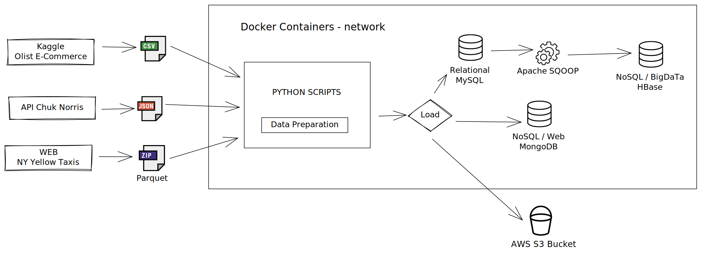

# Engenharia de Dados com Python

## Objetivo Geral

Este projeto tem por objetivo demonstrar as principais formas de integração da linguagem Python com diversas ferramentas de armazenamento e gestão de dados. 

De forma prática vamos Extrair e Transformar e Carregar dados em diversos tipos de ferramentas para bancos de dados, como bancos de dados Relacionais, bancos NoSQL em ambiente web e Big Data bem como em armazenamento de cloud.

Algumas das principais ferramentas para bancos de dados por tipo são:

**Relacionais**
- MySQL
- Postgres
- SQLite
- Oracle
- SQL Server

**NoSQL**
- MongoDB
- HBase

**Cloud**
- Amazon S3
- Google Cloud Storage
- Microsoft Blob Storage

Neste projeto vou procurar demonstrar a carga da forma mais otimizada possível em pelo menos uma ferramenta de armazenamento de cada tipo.

No grupo dos bancos relacionais optei por realizar a carga no MySQL entretanto o script gerado é fácilmente adptável para qualquer outro banco relacional, bastando apenas a alteração da string de conexão e instalação dos drivers. Isso foi possível graças a ajuda da biblioteca [SQLAlchemy](https://www.sqlalchemy.org/) do Python.

No grupo dos bancos NoSQL optei por criar um exemplo para cada um dos dois mencionados. 

No caso do MongoDB desenvolvi um script que recebe arquivos JSON, tipo comun para dados da web, tranforma os dados e carrega no banco. 

No cado do HBase crie um script especifico para com a ajuda do Scoop, ferramenta de big data, realizar as cargas de dados para HDFS e tabelas no HBase.

Finalmente para o grupo de Cloud desenvolvi um script que faz a carga de dados para um bucket no S3, o que a partir dai tornaria o dados disponível para, por exemplo, o processo de ingestão no datalake.

## Descrição do Ambiente de Desenvolvimento

Toda a orquestração do nosso ambiente será conduzido através de script Python. 

Vamos criar um container docker para a execução dos scripts de orquestração, container este que estará na mesma rede dos outros container de :

- Servidor MySQL Server
- Servidor MongoDB
- Servidor Big Data com HBase.

### Arquitetura do Ambiente

## Descrição das fontes de Dados

Serão manipulados e tratados dados de 3 principais tipos:
- **CSV** - Arquivo comun baseado em texto
- **Parquet** - Formato de dados otimizado e comprimido, usual em big data
- **JSON** - tipo de dados semi-estruturado muito comun em aplicações Web.

### Ecommerce em CSV

Para arquivo CSV estaremos trabalhando com as bases públicas da Olist armazenados no Kaggle. 

Este conjunto de dados armazena informações sobre pedidos realizados na OList Store, e-commerce brasileiro. 

Encontre mais em [Kaggle - Brazilian E-Commerce Public Dataset by Olist ](https://www.kaggle.com/datasets/olistbr/brazilian-ecommerce/download)

### JSON da Web sobre Chuck Norris

Para o formato de dados JSON vamos criar uma integração python com a API Chuck Norris. 

Sim esta API livre bem legal nos retorna informações muito importantes e veridicas sobre um dos mais famosos artistas e mestre marcial de hollywood. 

Vamos realizar requisições as esta API, tratar os dados e armazenar no nosso MongoDB, como exemplo de extração de dados da web e armazenamento de documentos.

Fonte de Dados em [API Chuck Norris ](https://api.chucknorris.io/#!)

### Parquet sobre Nova Yourk e seus Taxis Amarelos

Por último estaremos extraindo arquivos parquet contendo informações sobre a circulação dos taxis amarelos na cidade de Nova Yourk. 

A intenção será armazenar as informações no nosso banco de dados Relacional MySQL e também realizar o upload dos arquivos originais em um bucket S3 na AWS. 

Fonte de Dados em [TLC Trip Record Data ](https://www1.nyc.gov/site/tlc/about/tlc-trip-record-data.page)